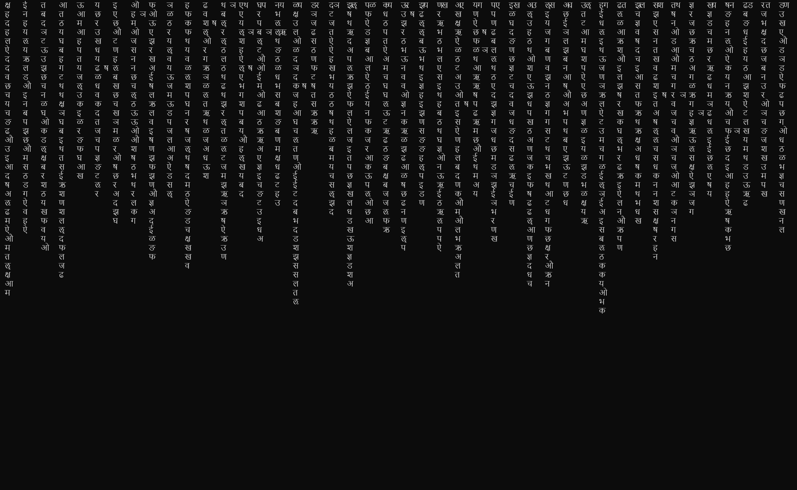

# Sansktrix
Sanskrit-Themed Matrix Screensaver for Your Linux/Unix Terminal – Watch Devanagari Characters Flow Like Digital Rain!



# Compile

Install nscurses devel files (e.g. `sudo apt-get install libncurses-dev` on Debian based Linux distros). Make sure that you have g++ in the prompt. Clone the repository and from within it run:

```bash
./compile
```

You can test the screen saver by simply running

```bash
./sansktrix
```

in your terminal. By default the multithreaded rain printing version is run, which produces smoother rain effect with variable speed columns. By running

```bash
./sansktrix --single_threaded_print
```

a less resource hungry, single threaded version of printing will draw your rain. You may want to have a look into the source code and play with parameters to test their effects!

# Set-up

Edit the header section of the `sansktrix_daemon.sh` within the repository

```bash
# Path to sansktrix executable
SANSKTRIX_PATH="$HOME/sansktrix/sansktrix"

# Default inactivity timeout in seconds
INACTIVITY_TIMEOUT=60 

# Single threaded printing (set equal to --single_threaded_print to enable)
SINGLE_THREADED_PRINT=
```

and add this line to your .bashrc file

```bash
# Start sansktrix daemon
$HOME/sansktrix/sansktrix_daemon.sh
```

You can test the script first by running it by hand and changing the idle timeout first

```bash
./sansktrix_daemon.sh
```

The daemon logs falling asleep instances in

```bash
/tmp/sansktrix_daemon.log
```

which is created anew every time the daemon starts.  You can also kill the daemon at any time by calling:

```bash
./sansktrix_kill.sh
```

This is a simple script, so it will kill all instances of your .sansktrix. (regex matched) processes (watch out open vim sessions on matching files!).

# Thanks

Many thanks to the authors of ChatGPT, DeepSeek, Claude Code, and GitHub's Copilot, all of which tools have greatly contributed to sketching and refining this code!

# Contribute

Feel free to contribute bug fixes and improvements.